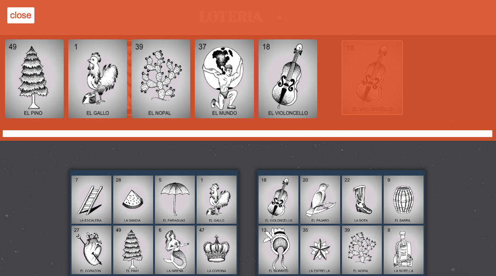

# Loteria
The online game of Loteria - much like bingo - is played with a minimum of 2 players. One player will select a card from a shuffled deck for everyone to see. Then, all players will compare the selected card to the cards on their board. If the card selected matches any of the cards on their board, they can mark it out. A player wins when they are the first to black out their board.


## Getting Started

Start by inputting the number of players for the game. If user gives no input, the game will default to 2 players.

```
Number of players: 2
```

The two stacks of cards at the top of the page represent the shuffled deck (on the left-hand side) and the cards selected (on the right-hand side).

```
Blank decks at start
```

When a player clicks on the shuffled deck, the other deck will display the card selected.

```
Card selected deck is displaying card after click
```

 When a player clicks on the cards selected deck, a modal will open with an image of all the cards that have been selected in the past rounds.
 
 ```
 Cards selected modal  
 ```

To see the instructions live, click on the triangle nav button at the top.


### Game-Rounds

Each time a player clicks on the shuffled deck to select a card, the computer will check for a winner. If no player has marked out their board, the game will continue. If a player has marked out their entire board, another modal will appear announcing the winner name and then reset the game.

```
Winner modal
```


### Pre-Requisites, Installation and Tests

No installation is needed for this game. The only pre-requisites are good wifi, a working browser and a fun attitude!


## Deployment

This game is best deployed on a computer browser since it is designed for a wide screen. Though mobile browsers will display the game correctly if it is played in landscape view. It is my hope that in the future, players will have this game available to them in a more mobile-browser-friendly way upon creating responsive code for narrow browsers.

## Built With

* **JQuery** - *Used to create the game logic and functionality.*
* **CSS** - *Used to make a beautifully styled and interactive site.*
* **HTML** - *Used to write the layout of my page.*
* **Josefina's Hand-drawn Art** - *Used to create the images for the cards.*
* **Pixelmator** - *Used to edit the drawings and create the card jpeg files because Adobe CC kept crashing.*
* **Tiny Scanner** - *Used to scan the drawings with my phone to get clean images to edit.*

## Contributing

At this moment, contributing will not be considered, but feedback is welcomed.


## Authors

* **Josefina Mancilla** - *coding and graphic work* - [jnm2377](https://github.com/jnm2377)


## Acknowledgments

* Thank you to Tyler G. who helped me fix the bugs in my checkWinner function!
* Special thanks to the original Loteria game I grew up playing, which inspired this online version.
* And a very extra special thanks to all the StackFlow community for having so many great explanations for all the questions I kept googling!
